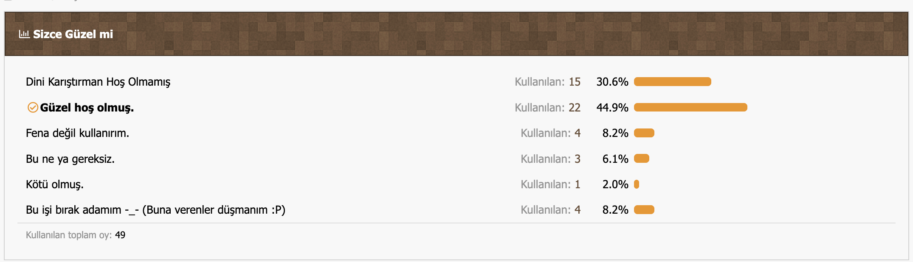

# Günah Plugini (v1.0 - 2014 Arşivi)

Bu depo, 2014 yılında bir Minecraft Forumunda tarafımca geliştirilip paylaşılan ve dönemin sunucularında eğlence amaçlı kullanılan "Günah Plugini"nin korunmuş orijinal kodlarını içerir.

## Video / Önizleme

Eklentinin nasıl çalıştığını (ve çarpılma anını) aşağıdan izleyebilirsiniz:

[Tanıtım Videosunu İndir](video.mp4)

---

## Oylama Sonuçları (2014)

Bu eklenti yayınlandığında forum üyeleri tarafından yapılan oylamanın orijinal sonuçlarıdır. Topluluğun eklentiye verdiği tepkiyi (ve mizahı) yansıtır.

---

## Nedir Bu Eklenti?

Günah Plugini, Minecraft sunucusuna basit bir "troll" mekaniği ekler.

* **Mekanik:** Oyuncu eline domuz eti (çiğ veya pişmiş) alıp sağ tıkladığında (yemeye çalıştığında)...
* **Sonuç:** Oyun tarafından anında üzerine şimşek düşürülür.
* **Mesaj:** Chat ekranında *"Günah olum domuz eti yenirmi çarpilacan simdi!"* uyarısı çıkar.

## Kurulum

Eklenti **1.7.x** sürümleri için yazılmıştır.

1. `.jar` dosyasını `plugins` klasörüne atın.
2. Sunucuyu başlatın.
3. Elinize domuz eti alın ve sağ tıklayın.
4. Çarpılmanın keyfini çıkarın.

## Arşiv Notu
Kodlar eğitim, eğlence ve arşiv amaçlı saklanmıştır. Modern Minecraft sürümlerinde (1.16+) `Material` isimleri değiştiği için (PORK -> PORKCHOP) kodun güncellenmesi gerekebilir.